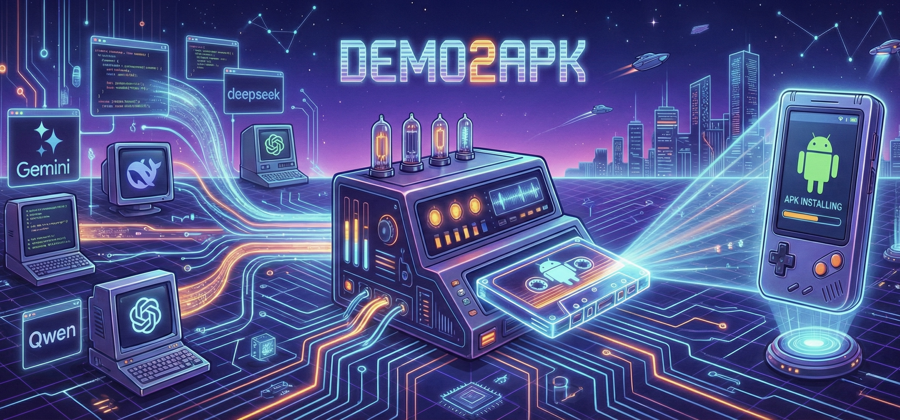

# Demo2APK 🚀


[中文文档](README_CN.md)

**Turn your Vibe Coding ideas into runnable Android Apps instantly.**

> 💡 **Scenario**: When you've built a demo on platforms like **Gemini**, **ChatGPT**, **DeepSeek**, **Qwen**, etc. and want to install it on your phone, Demo2APK is the perfect tool to turn your files into an installable Android APK instantly. Please don't accept APK files from others, as they may contain security risks!

Demo2APK is a one-click packaging tool built for Vibe Coding users. Whether you have a brilliant HTML prototype or a complete React project, just upload your files, and we'll generate an installable APK for you immediately. No complex Android development environment setup required—keep your creativity at your fingertips.

## 🌐 Free Public Service

We provide a **free public instance** for everyone:

👉 **[https://demo2apk.lasuo.ai](https://demo2apk.lasuo.ai)**

- 5 builds per IP per hour
- No registration required
- Fully functional, same as self-hosted

Hope this helps! If you find it useful, please ⭐ star this repo!

## ✨ Core Features

*   **🎨 Web Interface**: Immersive "Dark Engineering Blueprint" style UI for managing builds.
*   **✏️ Customization**: Support setting custom **App Name** and **App Icon** during upload.
*   **📋 Build History**: Automatically saves recent builds and supports **session restoration** after page refresh.
*   **⏳ Smart Queuing**: Handles concurrent builds with a real-time queue system and progress feedback.
*   **🔗 Easy Sharing**: Generate shareable download links instantly after build completion.
*   **⚡️ Blazing Fast**: Optimized cloud pipeline delivering APKs in minutes.
*   **🌐 Full Stack Support**: Perfect support for single HTML files, React, Vite, Next.js, and other modern frontend stacks.
*   **🧠 Smart Offline**: Automatically handles CDN resources and JSX compilation to ensure your App runs smoothly offline.
*   **🛡️ Rate Limiting**: Smart resource allocation (configurable for dev mode).
*   **🧹 Auto Cleanup**: Build artifacts are automatically deleted after 2 hours to protect privacy and save space.

## ⚠️ React Projects: Avoiding Blank Screens

> **Important**: If your React/Vite APK shows a **white/blank screen**, you need to add the legacy plugin for Android WebView compatibility.

```bash
npm install -D @vitejs/plugin-legacy terser
```

```javascript
// vite.config.js
import legacy from '@vitejs/plugin-legacy'

export default defineConfig({
  plugins: [
    react(),
    legacy({ targets: ['chrome >= 52', 'android >= 5'] })
  ],
  base: './'  // Required for APK!
})
```

📖 **[Full Guide: React Project Requirements](docs/REACT_PROJECT_REQUIREMENTS.md)** - Detailed troubleshooting for blank screen issues.

## 🚀 Quick Start

### Option 1: Docker Deployment (Linux Server)

Deploy to your Linux server in 3 minutes using pre-built Docker images.

> ⚠️ Docker images only support **linux/amd64**. For macOS, use [Local Development](#option-2-local-development-macos--linux).

```bash
# 1. Create deployment directory
mkdir -p ~/demo2apk && cd ~/demo2apk

# 2. Download deployment config
curl -O https://raw.githubusercontent.com/DeadWaveWave/demo2apk/main/docker-compose.deploy.yml

# 3. Start services
docker compose -f docker-compose.deploy.yml up -d
```

Visit **http://127.0.0.1:5173** to use the Web UI.

**Update to latest version:**
```bash
docker compose -f docker-compose.deploy.yml pull && docker compose -f docker-compose.deploy.yml up -d
```

### Option 2: Local Development (macOS / Linux)

For macOS users or local development:

```bash
# 1. Install dependencies
pnpm install

# 2. Start Redis
docker run -d -p 6379:6379 redis:alpine

# 3. Build project
pnpm build

# 4. Start all services (in separate terminals)
pnpm dev        # API Server (port 3000)
pnpm worker     # Build Worker
pnpm frontend   # Web UI (port 5173)
```

Visit **http://localhost:5173** to use the Web UI.

### Option 3: Cloudflare Pages (Frontend Only)

Host just the React UI on Cloudflare Pages and point it to your own backend/worker stack:

1. Set build command to `pnpm --filter frontend build`, output directory `packages/frontend/dist`.
2. Configure environment variable `VITE_API_BASE_URL=https://your-backend.example.com`.
3. (Optional) Set `VITE_GITHUB_REPO=keithhegit/apk_converter` to control the star badge.

See [Cloudflare Pages Deployment](DEPLOYMENT_CLOUDFLARE_PAGES.md) for details. The build pipeline itself cannot run on Pages/Workers; keep it on a separate server.

### Option 2: API Usage

If you prefer CLI or script integration, use our REST API.

**Single HTML File:**

```bash
curl -X POST http://localhost:3000/api/build/html \
  -F "file=@test-demo.html" \
  -F "appName=TestDemo"
```

**React Project:**

```bash
# Zip your project first
zip -r test-react-app.zip test-react-app/

# Upload and build
curl -X POST http://localhost:3000/api/build/zip \
  -F "file=@test-react-app.zip" \
  -F "appName=TestReactApp"
```

See [API Documentation](docs/API.md) for details.

## ⚙️ Configuration

### Rate Limiting

To ensure fair usage, rate limiting is enabled by default:

*   **Limit**: Max **5 requests** per hour per IP.
*   **Dev Mode**: Can be disabled via environment variables for local development.

Set in `.env`:

```bash
# Disable rate limiting (dev/test only)
RATE_LIMIT_ENABLED=false

# Custom limit (default 5)
RATE_LIMIT_MAX=10
```

### File Retention

To save storage and protect user data:

*   **Retention**: Generated APKs and temp files are deleted after **2 hours**.
*   **Cleanup**: Background worker scans for expired files every 30 minutes.

Configure via environment variable:

```bash
# Retention period (hours)
FILE_RETENTION_HOURS=2
```

### Concurrency & Queuing

Control how many builds run simultaneously. Excess builds will be queued automatically.

```bash
# Number of concurrent builds (default 2)
WORKER_CONCURRENCY=2
```

## 📝 Changelog

See [CHANGELOG.md](CHANGELOG.md) for release history.

## 📚 Documentation

- **[API Docs](docs/API.md)** - Complete REST API reference
- **[Deployment Guide](DEPLOYMENT.md)** - Production deployment instructions
- **[React Project Guide](docs/REACT_PROJECT_REQUIREMENTS.md)** - Best practices for React compatibility (avoiding blank screens)
- **[Cloudflare Pages Deployment](DEPLOYMENT_CLOUDFLARE_PAGES.md)** - Static hosting for the UI with external backend

## 🛠️ Tech Stack

*   **Frontend**: React, Vite, Tailwind CSS (Blueprint Style)
*   **Backend**: Node.js, Fastify, TypeScript
*   **Queue**: BullMQ, Redis
*   **Build**: Cordova, Capacitor, Gradle
*   **Deploy**: Docker, Docker Compose

## 📈 Community

[](https://star-history.com/#DeadWaveWave/demo2apk&Date)

---

**Made with ❤️ for Vibe Coding**

